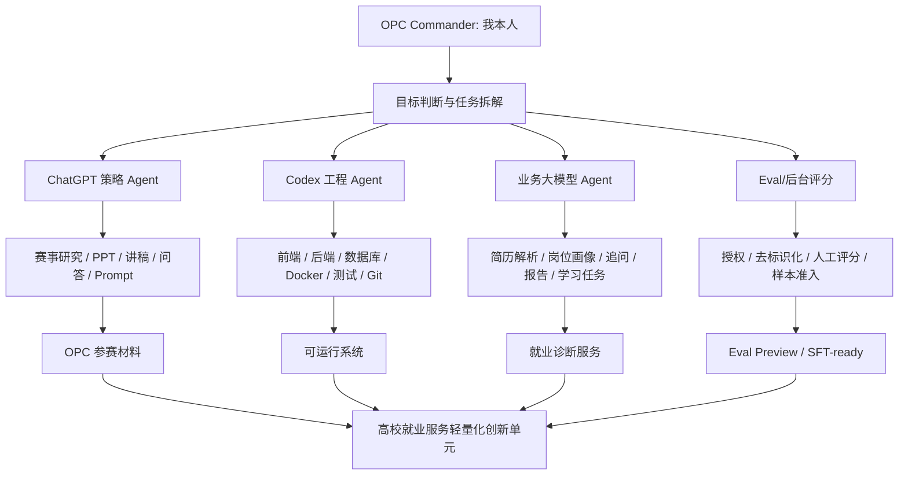
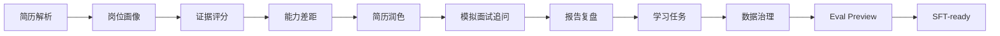

# 03 AI 工作流总图

## 1. 总图

## 2. 产品内业务流

## 3. 工作流验收口径

每一轮任务必须回答：

- 输入是什么。
- 哪个 AI Agent 处理。
- 人在哪里做判断。
- 输出物是什么。
- 如何验证不越界。
- 是否可沉淀到任务记忆或样本资产。

## 4. 当前可展示证据

- `/competition/agent-trace` 三岗位沙盘。
- `demo_cases/` 三岗位 demo。
- `artifacts/agent_trace/` Trace 输出。
- `artifacts/eval/` Eval Preview。
- `artifacts/sft_preview/` SFT Preview。
- `PROJECT_MEMORY.md` 和 `任务记录文档.md` 长期任务记忆。
