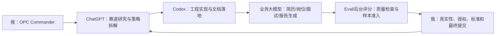

# 阶段 166 OPC AI 协同展示页与 PPT 制作 Brief

## 1. 一句话主张

```text
职启智评 OPC：一个人作为 OPC Commander，调度 ChatGPT、Codex、业务大模型和 Eval/后台评分，构建高校就业能力诊断与训练服务单元。
```

这句话必须贯穿 PPT、展示页、演示脚本和评委问答。不能退回“AI 面试官系统”的单点功能叙事。

## 2. 12 页 OPC PPT 结构

| 页码 | 页面标题 | 核心主张 | 证据对象 | 必须保留的边界 |
|---:|---|---|---|---|
| 1 | 我是 OPC Commander | 一个人负责目标、边界、验收和最终责任 | OPC 主体定位图 | AI 不替代真实性和合规判断 |
| 2 | 为什么是高校就业服务 | 就业准备存在岗位认知、简历证据和训练反馈缺口 | 痛点三卡 | 不夸大市场规模 |
| 3 | 职启智评 OPC 是什么 | 不是单点面试工具，而是就业能力诊断与训练单元 | 产品闭环图 | 当前为可运行原型与 preview 链路 |
| 4 | AI 协同工作流 | 多 AI 形成上下游，不是混用工具 | AI 协同流程图 | 人保留最终责任 |
| 5 | 人机协同分工 | AI 做高频执行，人做目标、授权、评分标准和验收 | 人机边界表 | 不说 AI 完全替代就业老师 |
| 6 | Career-AgentOS 底座 | 原系统提供可运行工程基础 | 用户端/后台/后端/数据库架构 | 不写成新建空壳项目 |
| 7 | 简历到训练闭环 | 简历解析、岗位画像、证据评分、能力差距、润色、面试、报告、学习任务 | 主链路图 | 岗位知识库只作参考 |
| 8 | AI Agents 如何协作 | OPC、赛事研究、Codex 工程、业务 Agent、Eval、Defense Coach 分工 | Agent 分层图 | 不把 demo 当真实用户数据 |
| 9 | 三岗位 demo 与 Agent Trace | Python 后端、产品助理、人力资源三类沙盘可展示 | Agent Trace preview | 标明 demo/preview |
| 10 | Eval 与 SFT-ready 门禁 | 评估和训练准备有门槛，不靠口头包装 | Eval/SFT preview 摘要 | 不说真实训练已跑完 |
| 11 | 复赛限时实测能力 | 新岗位可按固定方法拆成 AI 工作流 | 30/45/60 分钟训练包 | 说方法论可迁移，不说所有岗位已验证 |
| 12 | 三个月补实路线 | 从 demo 到真实样本、人工复核、对照评估和试点 | 补实路线图 | 未达标前不宣称补实结果 |

## 3. `/competition/opc-ai-workflow` 展示页结构草案

展示页不是普通宣传页，应是“AI 协同工作流控制台”的形式。

推荐页面区块：

1. 顶部定位：`OPC Commander 控制台`，说明这是比赛展示页。
2. AI 协同链路：ChatGPT -> Codex -> 业务大模型 -> Eval/后台评分 -> 人类验收。
3. 当前任务示例：把“高校就业能力诊断”拆成调研、工程、业务生成、评估、答辩五类任务。
4. Agent 分工矩阵：每个 Agent 的输入、输出、人工验收点。
5. 证据资产区：Prompt chain、Codex task bundle、handoff log、workflow trace 的格式样例。
6. Career-AgentOS 连接区：跳转到 `/competition/agent-trace`，展示三岗位 preview。
7. 复赛实测区：30/45/60 分钟题目和标准作答模板。
8. 边界区：说明哪些是已实现原型、哪些是 preview、哪些进入三个月补实。

## 4. AI 协同流程图



展示重点：

- ChatGPT 负责策略与任务表达。
- Codex 负责把任务落成代码、脚本、Markdown、测试和 Git 记录。
- 业务大模型负责简历诊断、岗位画像、追问、报告和学习任务。
- Eval/后台评分负责质量、准入和风险发现。
- 人负责目标、真实性、授权、评分标准和最终责任。

## 5. 人机边界表

| 工作项 | AI 负责 | 人负责 | 验收证据 |
|---|---|---|---|
| 赛道理解 | 搜索资料、提炼评审关键词、生成叙事草案 | 判断是否适合项目真实状态 | OPC 赛事适配判断 |
| 工程实现 | 生成脚本、页面、测试、文档修改方案 | 审查是否破坏主链路、决定是否提交 | Git commit、测试输出 |
| 业务生成 | 生成岗位画像、简历润色建议、追问和报告 | 确认不编造经历、不越过隐私授权 | Agent Trace、报告、后台复核 |
| 质量评估 | 规则评分、样本准入、PII 风险提示 | 制定评分标准，决定是否纳入样本 | Eval Preview、人工评分 |
| 答辩材料 | 生成 PPT 结构、讲稿、问答库 | 删除夸大表述，确认最终口径 | PPT Brief、审查报告 |

## 6. 可用证据素材清单

- `docs/competition/opc/README_OPC参赛总入口.md`
- `docs/competition/opc/03_AI工作流总图.md`
- `docs/competition/opc/04_人机协同分工图.md`
- `docs/competition/opc/live_test_drills/`
- `docs/competition/opc_ai_coordination/AI协同总架构.md`
- `docs/competition/opc_ai_coordination/AI使用顺序手册.md`
- `docs/competition/opc_ai_coordination/Prompt模板库.md`
- `artifacts/opc_ai_coordination/*.sample.*`
- `docs/agents/OPC角色体系索引.md`
- `artifacts/agent_trace/`、`artifacts/eval/`、`artifacts/sft_preview/`

注意：`artifacts/opc_ai_coordination/*.sample.*` 是证据格式样例，只能用于说明如何记录 AI 协同过程，不能说成完整真实运行日志。

## 7. 复赛限时实测桥接页

PPT 和展示页都应保留一个复赛实测桥接区：

```text
如果现场给我一个新岗位，我会在 30 分钟内完成：场景识别 -> 工作流拆解 -> Agent 分工 -> 输出物定义 -> 质量门禁 -> 三个月补实路线。
```

推荐展示一个示例岗位：

```text
新媒体运营实习生
```

对应输出：

- 岗位画像 Agent：提取内容策划、账号运营、数据复盘、协作沟通。
- 简历证据 Agent：识别作品集、运营数据、活动经历、内容工具。
- 简历润色 Agent：只润色已有内容，不新增未经证明的数据。
- 面试追问 Agent：追问一次选题、发布、复盘和指标改进过程。
- Eval Agent：检查回答是否有具体场景、行动、结果和反思。

## 8. 每页和每区块必须保留的边界

- 当前展示包含 Career-AgentOS Preview、Agent Trace、Eval Preview 和 SFT-ready 工程门禁。
- demo/preview 样本用于比赛展示和链路验证。
- 真实授权样本、真实训练作业和真实对照评估进入三个月补实路线。
- AI 不替代人工最终判断，隐私授权、真实性和评分标准由人负责。
- 不同意数据贡献不影响核心功能，但不能进入评测/训练样本沉淀。
