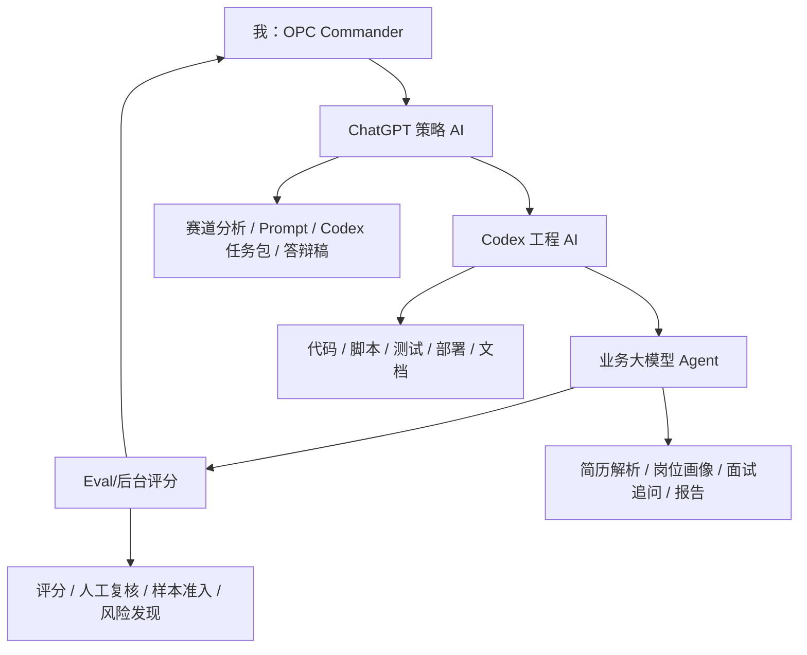

# AI 协同总架构

## 1. 总定位

```text
我作为 OPC Commander，把 ChatGPT、Codex、业务大模型、Eval/后台评分组织成一条 AI 协同生产线。
```

## 2. 架构



## 3. 创新点

- AI 之间有上下游，不是混用工具。
- Prompt 被拆成战略 Prompt、工程 Prompt、业务 Prompt 和评估 Prompt。
- 聊天记录会沉淀为 Codex 任务、Markdown、脚本、页面、测试和任务记忆。
- 人保留最终责任，AI 不替代真实性和合规判断。
