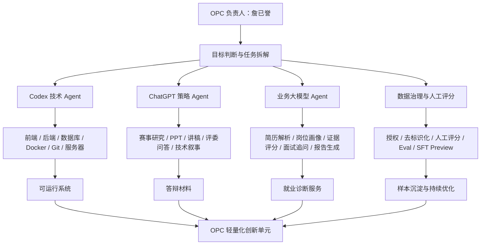

# OPC 人机协同工作流架构

## 1. 总体架构



## 2. 人干什么

OPC 负责人负责不可外包的判断：

```text
1. 确定参赛方向和项目定位。
2. 判断哪些功能必须实现，哪些可以先做演示资产。
3. 判断 AI 生成内容是否可信。
4. 控制隐私授权、样本边界和答辩真实性。
5. 选择垂直场景：高校就业服务 / 大学生求职训练。
6. 负责最终演示、答辩和项目治理。
```

## 3. AI 干什么

AI 分为三类：

### 3.1 Codex 技术 AI

```text
负责代码、接口、数据库、迁移、测试、Docker、服务器、Git、日志排查、脚本自动化。
```

典型任务：

```text
新增 Agent Trace 页面
修复后端 API
生成 demo_cases
跑 pytest 和 build
写部署脚本
更新 PROJECT_MEMORY.md
```

### 3.2 ChatGPT 策略 AI

```text
负责赛事理解、竞品分析、答辩结构、PPT 大纲、讲稿、评委问答、技术包装、风险边界。
```

典型任务：

```text
搜索 OPC 赛事通知
提炼评审重点
重构参赛叙事
模拟评委拷问
生成 3 分钟 / 8 分钟讲稿
```

### 3.3 业务大模型 Agent

```text
负责职启智评系统内部业务：简历理解、岗位画像解释、能力差距总结、面试追问、回答评价、报告复盘。
```

典型任务：

```text
解析简历
生成证据状态
根据岗位画像生成追问
润色简历但不编造经历
生成学习任务和报告
```

## 4. 工作流分层

```text
L0：OPC 总控层
- 目标、边界、取舍、验收

L1：AI 生产力层
- Codex、ChatGPT、大模型 API、脚本、自动化检查

L2：业务 Agent 层
- 简历证据、岗位画像、Gap、润色、面试、报告、学习任务、Eval

L3：数据闭环层
- 授权、去标识化、人工评分、Preview、SFT-ready、三个月补实

L4：产业场景层
- 高校就业服务、大学生求职能力训练、就业指导数字化
```

## 5. 一个人如何替代一个小团队

| 小团队角色 | OPC 中的替代方式 |
|---|---|
| 产品经理 | OPC 负责人 + ChatGPT 策略 Agent |
| 前端工程师 | Codex 技术 Agent |
| 后端工程师 | Codex 技术 Agent |
| 运维工程师 | Codex + Docker/Caddy 部署脚本 |
| 就业指导老师 | 岗位画像 + 人工审核 + 面试官 Agent |
| 简历顾问 | Resume Polish Agent + 人工边界审核 |
| 数据标注员 | Data Governance Agent + 后台人工评分表 |
| 测试工程师 | Eval Judge Agent + 自动化脚本 |
| 答辩教练 | Defense Coach Agent |

## 6. 答辩可用表达

```text
我的创新不是让 AI 替我完成一切，而是把原来需要产品、研发、就业老师、简历顾问、测试和运营共同完成的工作，拆成可编排、可追踪、可复盘的 AI 工作流。我作为 OPC 负责目标、标准、边界和最终责任，AI 负责高频执行和内容生产。
```
