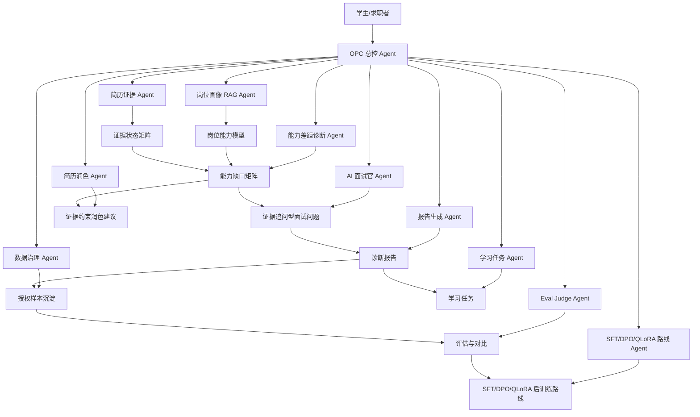

# 项目重新定位：从 AI 面试官到 Career-AgentOS

## 1. 为什么要重新定位

如果项目只讲“AI 面试官”，评委容易认为：

```text
这只是一个调用大模型 API 的网页。
```

但现有项目已经不止是问几个面试题，它实际上具备这些基础：

```text
简历解析
岗位画像
证据状态
能力差距诊断
简历润色
学习任务
模拟面试
报告生成
用户授权
后台人工评分
微调样本准备
```

所以比赛答辩要把主叙事改成：

```text
职启智评是一套面向大学生就业准备的多智能体诊断与训练系统。
```

更进一步，给架构命名为：

```text
Career-AgentOS
```

中文解释：

```text
面向就业能力诊断的多智能体操作系统。
```

---

## 2. 新旧定位对比

| 维度 | 原说法 | 比赛版新说法 |
|---|---|---|
| 产品定位 | AI 面试官 | 多智能体就业能力诊断与提升平台 |
| 技术核心 | 大模型问答 | 岗位画像 + 简历证据 + 多 Agent + Eval + SFT 数据闭环 |
| 用户价值 | 模拟面试 | 诊断能力缺口、优化简历表达、追问证据、生成学习路径、持续训练 |
| 创新点 | AI 生成面试题 | Career-AgentOS 多智能体协同诊断架构 |
| 数据闭环 | 用户回答 | 授权样本、人工评分、Eval、SFT/DPO 数据沉淀 |
| 答辩观感 | 常规应用 | 有架构、有闭环、有后训练路线的 AI 工程系统 |

---

## 3. 新主线一句话

```text
职启智评通过 Career-AgentOS 多智能体架构，把岗位画像、简历证据、能力缺口、证据约束简历润色、模拟面试、报告生成、学习任务、人工评分和模型后训练串成一条闭环，让每一次求职训练都能反哺下一轮诊断能力优化。
```

---

## 4. 核心架构图



---

## 5. 对评委的解释

推荐说法：

```text
我们没有把大模型当成一个黑盒聊天接口，而是把它拆入就业能力诊断的多个环节中。
每个 Agent 只负责一个明确任务：岗位画像约束、简历证据识别、能力缺口定位、证据约束简历润色、面试追问、报告生成、数据治理、评估和后训练。
这样系统不只是能生成内容，而是能形成可解释、可评估、可沉淀、可持续优化的 AI 工程闭环。
```

---

## 6. 新定位的好处

```text
1. 能回避“只是调 API”的低级质疑。
2. 能把现有功能统一成一个技术架构。
3. 能自然引出微调、DPO、QLoRA 等后续路线。
4. 能支撑 PPT 架构图、流程图、数据闭环图。
5. 能适配一人项目：你本人就是 OPC，总控多个虚拟 Agent。
```
