# Career-AgentOS 多 Agent 架构设计

## 1. 架构目标

Career-AgentOS 的目标不是炫技，而是把原项目的业务能力整理成评委能理解的 AI 工程架构：

```text
输入：简历 + 目标岗位 + 面试上下文
处理：多 Agent 协作诊断
输出：能力缺口、证据约束简历润色、证据追问、报告、学习任务、样本沉淀、Eval 和微调 Preview
```

---

## 2. 总体架构

```mermaid
flowchart LR
    Input[输入层: 简历/岗位/面试上下文] --> Orchestrator[OPC Orchestrator]

    Orchestrator --> ResumeAgent[简历证据 Agent]
    Orchestrator --> RoleAgent[岗位画像 RAG Agent]
    ResumeAgent --> Evidence[证据状态矩阵]
    RoleAgent --> RoleProfile[岗位能力画像]

    Evidence --> GapAgent[能力差距 Agent]
    RoleProfile --> GapAgent
    GapAgent --> GapMatrix[能力缺口矩阵]

    GapMatrix --> PolishAgent[简历润色 Agent]
    PolishAgent --> Polish[证据约束润色建议]

    GapMatrix --> InterviewAgent[AI 面试官 Agent]
    InterviewAgent --> Questions[证据追问问题]

    Questions --> ReportAgent[报告 Agent]
    GapMatrix --> ReportAgent
    ReportAgent --> Report[诊断报告]

    Report --> LearningAgent[学习任务 Agent]
    LearningAgent --> Plan[学习路径]

    Report --> DataAgent[数据治理 Agent]
    Questions --> DataAgent
    DataAgent --> SamplePool[样本池]

    SamplePool --> EvalAgent[Eval Judge Agent]
    EvalAgent --> EvalReport[评分与对比]

    SamplePool --> SFTAgent[SFT/DPO/QLoRA Agent]
    EvalReport --> SFTAgent
    SFTAgent --> TrainingAssets[后训练资产]
```



---

## 3. 三层落地架构

### V0：文档型 Agent

最快，适合赛前。

```text
docs/agents/*.md
```

用途：

```text
让 Codex 和答辩材料有统一角色定义。
```

---

### V1：脚本型 Agent

赛前最实用。

```text
app/scripts/generate_demo_cases.py
app/scripts/export_agent_trace.py
app/scripts/run_interview_eval_preview.py
app/scripts/build_sft_preview.py
```

用途：

```text
生成演示数据、Agent Trace、Eval 表格、SFT Preview。
```

---

### V2：服务型 Agent

三个月内补实。

```text
app/services/agent_orchestrator/
  schemas.py
  registry.py
  orchestrator.py
  trace_logger.py
  demo_pipeline.py
```

用途：

```text
把 Agent 工作流接入真实后端 API 和前端页面。
```

---

## 4. Agent 列表

| Agent | 职责 | 赛前是否必须实现代码 | PPT 价值 |
|---|---|---:|---:|
| OPC Commander | 总控流程和任务编排 | 可先文档化 | 高 |
| Resume Evidence Agent | 提取简历证据状态 | 建议脚本化 | 很高 |
| Role Profile RAG Agent | 检索岗位画像 | 可脚本化/复用现有 | 高 |
| Gap Diagnosis Agent | 生成能力缺口矩阵 | 建议脚本化 | 很高 |
| Resume Polish Agent | 生成证据约束润色建议 | 复用现有润色能力，建议脚本化展示 | 高 |
| Interviewer Agent | 生成证据追问 | 复用现有大模型调用 | 很高 |
| Report Agent | 输出报告摘要 | 复用现有 | 中高 |
| Learning Plan Agent | 输出学习任务 | 复用现有 | 中 |
| Data Governance Agent | 授权、脱敏、样本准入 | 文档+脚本 | 高 |
| Eval Judge Agent | 评分和对比 | 建议脚本化 | 很高 |
| SFT Agent | 生成 SFT Preview | 已有路线，强化展示 | 高 |
| Defense Agent | 评委问答 | 文档化 | 很高 |

---

## 5. Agent 输入输出协议

建议所有 Agent 输出都包含：

```json
{
  "agent_name": "ResumeEvidenceAgent",
  "version": "competition-v1",
  "input_summary": "输入摘要，不含敏感信息",
  "output": {},
  "confidence": 0.82,
  "evidence_refs": [],
  "warnings": [],
  "for_demo": true
}
```

这样方便导出 trace。

---

## 6. Agent Trace 标准

一次完整 trace 至少包含：

```text
Step 1：简历证据 Agent 输出能力证据表
Step 2：岗位画像 Agent 输出岗位能力要求
Step 3：能力差距 Agent 输出缺口矩阵
Step 4：简历润色 Agent 输出岗位化润色建议和风险提示
Step 5：面试官 Agent 输出证据追问
Step 6：报告 Agent 输出诊断摘要
Step 7：Eval Agent 输出评分
Step 8：SFT Agent 输出样本 Preview
```

---

## 7. 最小可运行 demo pipeline

输入：

```text
demo_cases/python_backend.json
```

输出：

```text
artifacts/agent_trace/python_backend.trace.json
artifacts/agent_trace/python_backend.trace.md
artifacts/eval/python_backend.eval.csv
artifacts/sft_preview/python_backend.train.preview.jsonl
```

命令建议：

```bash
python -m app.scripts.generate_competition_assets
```

---

## 8. 设计重点

不要为了“多 Agent”而多 Agent。

每个 Agent 必须对应一个业务问题：

```text
简历证据 Agent：解决简历真假和证据不足问题。
岗位画像 Agent：解决通用面试不贴岗位问题。
能力差距 Agent：解决诊断不聚焦问题。
简历润色 Agent：解决简历表达不贴岗位和润色容易编造经历的问题。
面试官 Agent：解决追问泛泛问题。
Eval Agent：解决无法证明效果问题。
SFT Agent：解决后续模型持续优化问题。
```
